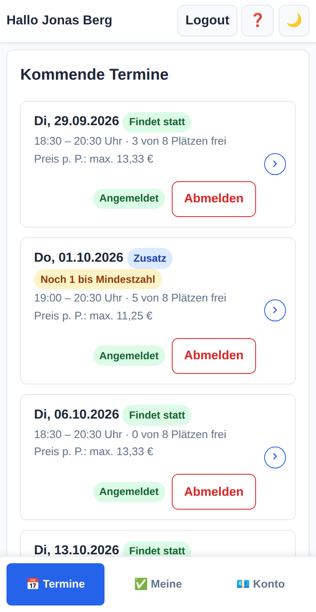
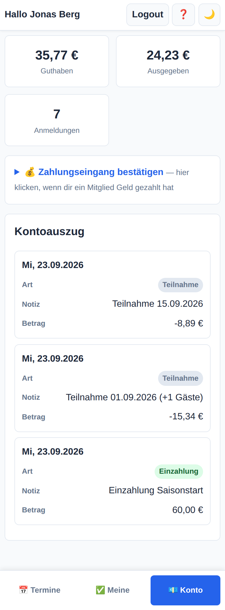
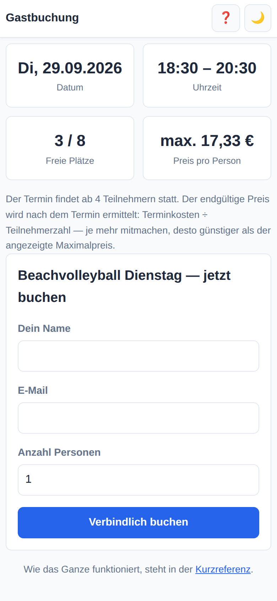

# SportEvent Manager

Eine kleine Webanwendung, um wiederkehrende Sporttermine zu organisieren und
die Kosten fair unter den Teilnehmern aufzuteilen — zum Beispiel das
wöchentliche Beachvolleyball-Abo in der Halle.

Die Idee: Eine Gruppe mietet ein Feld für eine ganze Saison und zahlt dafür
einen Gesamtbetrag. Wer an welchem Termin dabei ist, schwankt. Der
SportEvent Manager verteilt die Kosten automatisch auf die tatsächlich
Anwesenden, führt für jedes Mitglied ein Guthabenkonto und lässt Gäste über
einen Link mitbuchen, ohne dass sie ein Konto brauchen.

<p align="center">
  
  
  
</p>

## Was die Anwendung kann

**Termine aus einem Abo erzeugen.** Ein Abo hat einen Zeitraum und einen
Wochenplan (z. B. „dienstags 20:00–22:00"). Daraus entstehen die einzelnen
Termine. Zusatztermine außerhalb des Plans sind möglich.

**Kosten teilen statt Festpreise.** Der Abo-Preis ist ein Gesamtbetrag für
den ganzen Zeitraum, kein Preis pro Termin. Die Anwendung verteilt ihn auf
die noch offenen Termine; an jedem Termin teilen sich alle Anwesenden das
Budget. Kommen weniger Leute, wird es für den Einzelnen teurer — deshalb
zeigt die Oberfläche eine Preisstaffel statt einer einzelnen Zahl. Unterhalb
einer Mindestteilnehmerzahl findet der Termin nicht statt.

**Mitglieder und Gäste.** Mitglieder melden sich per Magic Link an (kein
Passwort) und buchen sich für Termine ein, optional mit Begleitung. Gäste
ohne Konto buchen über einen geheimen Link zum jeweiligen Termin. Ist ein
Termin voll, gibt es eine Warteliste, die automatisch nachrückt.

**Abrechnung.** Nach einem Termin wird abgerechnet: Jedes Mitglied wird mit
seinem Anteil belastet, das Guthabenkonto aktualisiert, und alle Beteiligten
bekommen eine E-Mail mit ihrem Betrag. Gäste erhalten eine Zahlungsauf-
forderung, deren Eingang sich abhaken lässt.

**Absagen mit Fristen.** Zwei Fristen pro Abo regeln, bis wann man sich frei
abmelden kann, ab wann nur noch auf Anfrage, und ab wann gar nicht mehr.
Anfragen genehmigt ein Super-Mitglied.

**Super-Mitglieder.** Einzelne Mitglieder bekommen erweiterte Rechte
innerhalb ihres Abos: Termine absagen, Zusatztermine anlegen, abrechnen,
Teilnehmerlisten sehen — ohne vollen Administratorzugang.

**Erinnerungen und Auto-Abrechnung** laufen als Hintergrundaufgabe.

**Handbuch inklusive.** Unter `/hilfe` liegen ein ausführliches Handbuch und
eine dreiseitige Kurzreferenz, beide mit Screenshots und zum Ausdrucken als
PDF gedacht.

## Technik

Serverseitig gerendert, bewusst ohne Frontend-Build:

- **Python 3.12**, FastAPI, SQLAlchemy 2.0, Jinja2, SQLite
- Formulare statt JSON-API, HTML-Antworten statt Single-Page-App
- kein CSS-Framework, kein npm — eine einzige `style.css` mit
  Design-Tokens, Hell- und Dunkelmodus
- installierbar als PWA (Manifest und Icons enthalten)
- Oberfläche auf Deutsch, mobil zuerst gedacht

## Schnellstart

```bash
python3.12 -m venv .venv
source .venv/bin/activate
pip install -r requirements.txt

cp .env.example .env
# SECRET_KEY und ADMIN_PASSWORD setzen:
python -c "import secrets; print(secrets.token_urlsafe(48))"

uvicorn app.main:app --reload
```

Die Anwendung läuft dann auf http://127.0.0.1:8000. Der Administrationsbereich
liegt unter `/admin`, Mitglieder melden sich unter `/member/login` an.

Ohne konfiguriertes SMTP werden keine E-Mails verschickt. Damit man trotzdem
entwickeln kann, zeigt die Login-Seite die Magic Links in diesem Fall direkt
an — das gilt ausdrücklich nur außerhalb von `APP_ENV=production`.

Die Datenbank legt sich beim ersten Start selbst an; Schemaänderungen werden
beim Start automatisch nachgezogen.

## Konfiguration

Alle Einstellungen kommen aus der `.env` (Vorlage: `.env.example`):

| Variable | Bedeutung |
|---|---|
| `SECRET_KEY` | Schlüssel für Sitzungen und Token. In Produktion Pflicht. |
| `ADMIN_PASSWORD` | Passwort für den Administrationsbereich. In Produktion Pflicht. |
| `ADMIN_EMAIL` | Absender- und Kontaktadresse des Administrators |
| `APP_ENV` | `production` erzwingt eine sichere Konfiguration, `dev` erlaubt Standardwerte |
| `BASE_URL` | Öffentliche Basis-URL für Links in E-Mails |
| `COOKIE_SECURE` | `true` hinter HTTPS |
| `SMTP_*`, `EMAIL_FROM` | Mailversand; leer lassen heißt: keine E-Mails |
| `ENABLE_SCHEDULER` | Hintergrundaufgaben an oder aus |

## Sicherheit

Für eine Anwendung, die Geldbeträge verbucht, sind ein paar Dinge fest
eingebaut:

- **Sitzungen** liegen serverseitig in der Datenbank, im Cookie steht nur ein
  Token. Es landen keine Zugangsdaten im Browser.
- **Anmeldung ohne Passwort:** Mitglieder bekommen einen einmalig gültigen
  Link (15 Minuten). Die Antwort auf einen Anmeldeversuch ist immer gleich,
  egal ob die Adresse existiert.
- **CSRF-Schutz** über ein Double-Submit-Cookie, als Abhängigkeit auf allen
  Routern — nicht pro Formular nachgerüstet.
- **Belegungsprüfung innerhalb der Transaktion:** Die Buchung wird eingefügt
  und bei Überbuchung zurückgerollt, statt vorher zu zählen. Damit gibt es
  kein Zeitfenster für zwei gleichzeitige Buchungen auf den letzten Platz.
- **Zahlenwerte aus Formularen** werden serverseitig geprüft.
- **Anmeldeversuche** sind pro IP begrenzt.
- Der Start bricht ab, wenn in Produktion noch Standardwerte für
  `SECRET_KEY` oder `ADMIN_PASSWORD` gesetzt sind.
- Beträge sind durchgehend `Decimal`, nie Fließkommazahlen.
- Abhängigkeiten werden wöchentlich von Dependabot geprüft.

Wer eine Schwachstelle findet: bitte über die Sicherheitsfunktion des
Repositorys melden, nicht über ein öffentliches Issue.

## Tests

```bash
python -m pytest tests/ -q
```

Die Tests laufen gegen eine temporäre SQLite-Datenbank und lassen die
Hintergrundaufgaben aus — man kann sie jederzeit gefahrlos starten.

## Aufbau

```
app/
  main.py            Anwendung, Router eingehängt
  models/            Datenmodell
  routes/            admin/ member/ guest/ help
  services.py        Belegung, Preise, Abrechnung, Warteliste
  auth.py            Sitzungen, Magic Links, CSRF
  scheduler.py       Erinnerungen, automatische Abrechnung
  clock.py           Systemdatum (im Test überschreibbar)
  templates/         Jinja2-Vorlagen
  static/style.css   das gesamte Styling
docs/                Quellen für Handbuch und Kurzreferenz
scripts/             Demo-Daten, Screenshots, Handbuch bauen
tests/
```

Die gemeinsame Logik zu Belegung, Preisen und Abrechnung liegt in
`services.py` — Routen sollten sie benutzen, statt Abfragen zu wiederholen.

## Betrieb

Die Anwendung ist ein gewöhnlicher ASGI-Dienst: `uvicorn app.main:app` hinter
einem Reverse Proxy, der TLS beendet. Ein `Dockerfile` und ein
`docker-compose.yml` mit Caddy liegen bei; genauso gut lässt sie sich als
systemd-Dienst betreiben. Zu sichern ist nur das Verzeichnis `data/` mit der
SQLite-Datei — am besten so, dass die Anwendung dabei kurz stillsteht.

## Handbuch neu bauen

Die Screenshots im Handbuch stammen aus einer generierten Demo-Datenbank mit
erfundenen Personen:

```bash
pip install -r requirements-dev.txt
playwright install chromium

python scripts/demo_seed.py
python scripts/make_screenshots.py
python scripts/build_manual.py
```

## Lizenz

Apache License 2.0 — der vollständige Text steht in [LICENSE](LICENSE).
Nutzung, Änderung und Weitergabe sind erlaubt, solange Lizenztext und
Änderungshinweise erhalten bleiben; die Lizenz gewährt zusätzlich eine
Patentlizenz und schließt Gewährleistung und Haftung aus.

Copyright 2026 KaletoAI
